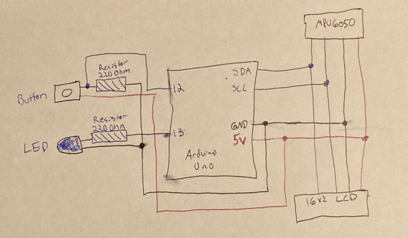

# CSE321 Project: Digital Level
Matthew Ciraolo

Hardware Components List:
  - Arduino Uno Rev 3
  - HiLetgo GY-521 MPU-6050 MPU6050 3 Axis Accelerometer Gyroscope Module
  - Blue LED
  - SunFounder IIC/I2C/TWI LCD1602 Display
  - Button
  - 2x 200Ohm Resistors
  - Wiring (ideally multiple colors for orgainzation)

Required Software Libraires:
  - LiquidCrystal_I2C.h
  - MPU6050.h

Hardware Setup Diagram:

